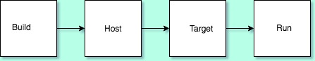

Platform Model
=============

Felix define four significant platforms:

* build platform: where Felix itself is built
* host platform: where you edit Felix code and translate to C++
* target platform: where you compile the C++
* run platform: where you run the compiled binaries

   platform model

Build platform
^^^^^^^^^^^^^^

If you download the Felix system sources and build Felix yourself,
your host platform is the build platform. However if you download
tarballs of prebuilt binaries, or use a package manager to fetch 
them, then another computer was used as the build platform.

Host platform
^^^^^^^^^^^^^

The system you program on is the host platform. A platform
is not just a computer, rather it is a machine together with
an operating system and working environment. For example
you can actually run Ubuntu on Windows 10 Summer Edition,
or you can run Cygwin. On OSX you can run the system clang
provided with Xcode, but you can also use `brew` to fetch
a more recent clang or even gcc.

Target platform
^^^^^^^^^^^^^^^

The target platform is where you run the C++ compiler.
If you're on Windows using Cygwin you will probably
be running a Posix hosted cross compiler targetting Windows.
however you can also invoke Visual Studio's C++ compiler
from Cygwin.

Run platform
^^^^^^^^^^^^

The run platform is where the binaries get run. You can
cross compile from Cygwin to produce binaries designed
to run natively on Windows (for C code anyhow!).

The model above is not a complete or accurate picture
of reality, however it is a reasonable approximation
which is used as a base for achieving your programming
goals with good reusability.

Platform Dependency Model
=========================

Felix uses a specific model for handling platform dependencies.

We will show how it works using the system shell as an example.

First, we define a type class parametrised by phantom type variables
representing the dependencies:

.. code-block:: felix

  class Shell_class[OS, process_status_t]
  {
    // Quote a single argument.
    virtual fun quote_arg:string->string;
 
    // quote a list of arguments
    fun quote_args (s:list[string]) : string => catmap[string] ' ' quote_arg s;

    ...
  }

The `Shell_class` is parametrised by two type variables, `OS` and `process_status_t`.
The virtual function `quote_arg` must be overriden in an instance. This class can be used
with any platform host to quote arguments for any platform target by setting the
parameters.

Now, we define a platform specific class for Posix systems:

.. code-block:: felix

  class Bash {

    instance Shell_class[Posix, PosixProcess::process_status_t] {
      fun quote_arg(s:string):string= {
        var r = "";
        for ch in s do
          if ch in "\\\"" do   // leave $ and ` in there, unquoted.
            r += "\\"+ str ch;
          else
            r+= ch;
          done
        done
        return '"'+r+'"';
      }
    }
    fun bash_specific_thing ...

    inherit Shell_class[Posix, PosixProcess::process_status_t];
  }

To define quoting for posix `bash` shell, we first specify an instance for
the abstract shell class `Shell_class` 
specifying the `OS` parameter as type `Posix`, and the `process_status_t`
parameters as `PosixProcess::process_status_t`, defining an 
override of the virtual `quote_arg`. 

We can also add some bash specific functions now.

Then we inherit `Shell_class` into `Bash`,
specifying the `OS` parameter as type `Posix`, and the `process_status_t`
parameters as `PosixProcess::process_status_t`, which also pulls in
`quote_args` function.

This gives us a complete set of operations on `Bash` including platform
independent ones and platform dependent ones.

We do the same for Windows:

.. code-block:: felix

  class CmdExe
  {
    instance Shell_class[Win32, Win32Process::process_status_t]
    {
      fun quote_arg(s:string):string => '"' + s + '"';
    }
    fun cmdexe_specific_thing ...

    inherit Shell_class[Win32, Win32Process::process_status_t];
  }

Finally, we use conditional compilation to define

.. code-block:: felix

  class Shell {
    if PLAT_WIN32 do
      inherit CmdExe;
    else
      inherit Bash;
    done
  }

The symbol `PLAT_WIN32` is a macro, set to true if the host OS is Windows.

What have we achieved?

* You can write code for the current host system using class `Shell`
  The generated C++ will only work on the current host.
  If your Felix code *only* uses platform independent features,
  it will work on other platforms too, but it has to be recompiled
  by the Felix compiler and will generate different C++.

  If your Felix code uses platform specific features it may fail
  to compile with Felix compiler because it depends on functions
  not included by conditional compilation.

* You can write code for Windows on *any* platform using class `CmdExe`.
  This Felix code is platform independent, it will Felix compile on
  all platforms.  The generated C++ may only
  compile on Windows and is only useful, whether it compiles or not,
  on Windows for calling the Windows shell.
 
* You can write code for Posix on *any* platform using class `Bash`.
  This Felix code is platform independent, it will Felix compile on
  all platforms. The generated C++ may only
  compile on Posix, and it is only useful, whether it compiles or not,
  on Posix platforms for calling Bash shell.

* You can write platform independent Felix code that is parametrised
  by the OS and process status types, which extends the base abstraction,
  without conditional compilation. The extension can then follow the 
  same platform model.

Code Description
----------------

As per the above platform model there are three ways to write code
that works on multiple platforms.

Platform Independent Code
^^^^^^^^^^^^^^^^^^^^^^^^^

First and foremost, you can write code in Felix that generates
the same C++ on all platforms, and which works the same way
on all platforms. There is an adaption layer which translates
the C++ for the platform, usually included in a combination
of 

* The Felix run time library (RTL),
* the C++ compiler's standard library and 
* the platform OS system C library. 

This kind of Felix code is said to be *platform independent*.

Platform Adaptive Code
^^^^^^^^^^^^^^^^^^^^^^

When you write code using the `Shell` class, using only Felix functions
in common to all platforms, the code is said to be *platform adaptive*. 
The interface is the same on both Windows and Posix but the 
function definitions are not. Here Felix itself uses conditional
compilation of Felix code to achieve interoperability. Consequently
the generated C++ will vary, depending on the host platform.

Platform Dependent Code
^^^^^^^^^^^^^^^^^^^^^^^

Using platform specific classes such as `Bash` or `CmdExe` you can
write platform dependent code for a *specific* target platform
independently of your current host platform.

Platform Parametric Code
^^^^^^^^^^^^^^^^^^^^^^^^

And finally using the parametrised `Shell_class` you can write
code which depends on platform specific features and *defer*
deciding how to implement or represent those features
or *abstract away* the problem, by using virtual functions.
We can call this *platform parametric* code.

Use Cases
---------

The most common way to use Felix is to write code for your
own system. In this case, platform specific code is good enough.
However if you want to share the code with other Felix programmers
you need to write platform adaptive code instead.

However, if you want to write code for non-programmer clients,
with a variety of platforms, you need to write platform independent
code. Failing that, you need to generate, from platform adaptive
code, multiple versions of the C++ code and arrange to compile
that code on these platforms, for example by using continuous
integration servers such as Travis (for Linux), or Appveyor 
(for Windows).

Configuration Databse
---------------------

Felix provides another mechanism to handle platform dependencies.

Linker switches
^^^^^^^^^^^^^^^

Even on the same Linux OS, libraries you need to link to can
be in various places. System libraries on Debian platforms
live in /usr/lib wheres if you build libraries yourself 
they usually end up in /usr/local/lib. OSX linkers use
frameworks whereas Linux does not. Similarly header
files can live in various places.

To meet the vagaries of compilation and linkage requirements, Felix provides
in-language clauses for type and function bindings to specify 
libraries required in the abstract, namely a `requires package`
clause. The specified package names are mapped to files ending in
extension `.fpc` in a configuration database, and those files
contain local specification of how to find and link the libraries.

Include Files
^^^^^^^^^^^^^

C/C++ header files are handled as well. 

For this, Felix compiler
outputs a single `#include "progname.includes"` directive,
and generates a file `progname.resh` which contains a list of
the required packages. An external tool, `flx_pkgconfig` queries
the configuration database and generates `progname.includes`
using the supplied information. The `flx` tool does this
automatically, and also uses the `resh` file to organise
compiler and linker switches.

Compiler Toolchain Drivers
^^^^^^^^^^^^^^^^^^^^^^^^^^

In addition, the `flx` tool uses plugins to drive your C++
compiler. Each compiler is driven by a distinct plugin
module which understands how to translate abstract compilation
and linkage requirements into specific command lines for 
that compiler and OS. Standard toolchains are provided for
`gcc` and `clang` on Linux and generic unix platforms
and for OSX, and for Visual Studion 2015's `cl.exe` on
Windows. There is also a driver for the iPhone emulator
and iPhone for iOS applications.

Compiler toolchain drivers must all provide ways to
perform the following abstract tasks:

* compile a C++ translation unit for static linkage to an object file
* compile a C++ translation unit for dynamic linkage to an object file
* combine static link objects into a searchable library
* combine dynamic link objects into a searchable library
* link static link objects and libraries to form a standalone executable
* link dynamic link objects to form a shared dynamic link library 
* static link a thunk which can invoke a shared library as a program

In general, linkers can link some code static and other code dynamic
in arbitrary combinations. This is too hard to generalise so Felix
only supports two models: static and dynamic link. Static link model
links everything with a flat namespace into a standalone executable
program.

Note that despite this on most platforms some libraries
are dynamic linked anyhow: the C library interfacing to the OS is
usually dynamically linked at load time on all platforms. Both OSX
and Windows usually dynamic link system level APIs. However system
dynamic linkage is usually transparent in the sense that the
libraries are already provided and do not have to be built,
and the mode of linkage is handled automatically by the linker.

Note also that, primarily to support archaic linkage models used
on Linux, Felix distinguishes object files desiged for static linkage,
and those designed for dynamic linkage: the latter requires -fPIC
position independent code, the former is a legacy model which 
executes slightly faster.

By default Felix adds the suffix `_static` to object file basenames
designed for static linkage, and `_dynamic` to object file basenames
for dynamic linkage, and similarly for searchable libraries built from them.
The reason is that unfortunately archaic linkage technology used on 
unix platforms can accidentally link the wrong kind of library
leading to inexplicable run time crashes.

