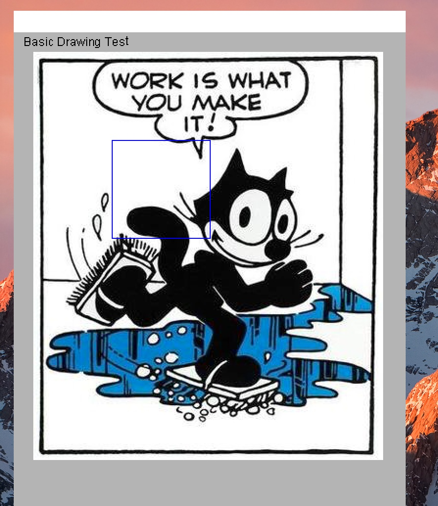

Putting Stuff in the Window
===========================

Now we have created a window, we want to put stuff on it!

Here's how:

.. code-block:: felix

    include "gui/__init__";
    open FlxGui;

    println$ "Basic Drawing Test";
    FlxGui::init();

    var w = create_resizable_window("Felix:gui_03_draw_01",100,100,400,600);
    w.add$ mk_drawable FlxGui::clear lightgrey;

    var font_name = dflt_sans_serif_font();
    var font : font_t = get_font(font_name, 12);
    var lineskip = get_lineskip font;
    w.add$ mk_drawable FlxGui::write (10,10,font,black,"Basic Drawing Test");

    fun / (x:string, y:string) => Filename::join (x,y);
    var imgfile = #Config::std_config.FLX_SHARE_DIR / "src" / "web" / "images" / "FelixWork.jpg";

    var ppic : surface_t = surface (IMG_Load imgfile.cstr);

    w.add$ mk_drawable blit (20,20, ppic.get_sdl_surface ());

    w.add$ mk_drawable draw_line (RGB(0,0,255), 100,110,200,110);
    w.add$ mk_drawable draw_line (RGB(0,0,255), 100,210,200,210);
    w.add$ mk_drawable draw_line (RGB(0,0,255), 100,110,100,210);
    w.add$ mk_drawable draw_line (RGB(0,0,255), 200,110,200,210);

    w.update();
    w.show();

    Faio::sleep(15.0);

Here, the program is as before, except we now do three basic
ways to draw on a window.

Text
----

First, we want to be able to put ordinary text on the window.
To do that, we have to first create a font to write the text
with:

.. code-block:: felix

    var font_name = dflt_sans_serif_font();
    var font : font_t = get_font(font_name, 12);
    var lineskip = get_lineskip font;

The first line gets the name of a default sans serif font
file which is packaged with Felix so you don't have to figure
out where all the fonts on your system are.

The second line actually creates the font from the file
at a particular size, in this case 12 point. The size is
a conventional printers measure. You'll just have to get used
to what it means!

The third line helps tell how big the font it. We retrieve
from the font the distance in pixels we should allow 
between lines, for readable text. Anything less and 
the characters would bump into each other.

Now we have a font, we schedule drawing some text on the window:

.. code-block:: felix

    w.add$ mk_drawable FlxGui::write (10,10,font,black,"Basic Drawing Test");

This is our usual machinery for adding a drawable object to the 
windows list of drawables, to be drawn when we say to `update`.
The drawing function is :code:`FlxGui::write`. Notice we used
the fully qualified name of the function, to avoid confusiuon
with other functions named `write`.

The argument to write is the x and y coordinates of the initial
base point, the font to use, the colour to write in, and the
actual text to write.

Text is always written with respect to a base point. 
The base point is origin of the first character which is
approximately the left edge of the character, and the
point at which an invisible underline would occur:
in other words, under the main body of the character,
but on top of any descender that letter like `g` may have.

The exact location is font dependent. Font rendering
is an arcane art, not an exact science so you will have
to practice to get text to appear where you it has
the correct visual significance.

Picture
-------

Now we are going to put a picture in the window.
The image is a JPEG image, and is supplied for testing
purposed in Felix at a known location.

First we define a little helper function:

.. code-block:: felix

    fun / (x:string, y:string) => Filename::join (x,y);

What this says is that when we try to divide one string
by another string, we actually mean to join the strings
together using :code:`Filename::join` which is a standard
function which sticks a `/` character between strings on unix
platforms, and a slosh on Windows.

The file is here:

.. code-block:: felix

    var imgfile = #Config::std_config.FLX_SHARE_DIR / "src" / "web" / "images" / "FelixWork.jpg";

The prefix of this code finds the share subdirectory of the 
Felix installation, which contains the picture we went in the 
images subdirectory of the web subdirectory of the src subdirectory.

Now to schedule the drawing we do this:

.. code-block:: felix

    var ppic : surface_t = surface (IMG_Load imgfile.cstr);
    w.add$ mk_drawable blit (20,20, ppic.get_sdl_surface ());

The first line loads the image file into memoy using a low
level primitive from SDL2_image. That primitve requires
a C char pointer, not a C++ string, which is what Felix uses,
so we use :code:`cstr` to convert. Then the `surface` function
translates the loaded file into an Felix surface object.

In the second line we add the drawable to the window based
on the :code:`blit` function. This copies one surface to another.
We copy the image surface to the window surface at position 20,20
in the window, and use the :code:`get_sdl_surface()` method to
translate the Felix surface object into a lower level SDL surface.

Its all a bit mysterious, so you just have to so some things
by copying the patterns that work.

Lines
-----

Finally, we draw a blue rectangle on top of the picture.
I'm sure you can figure out how that works!

