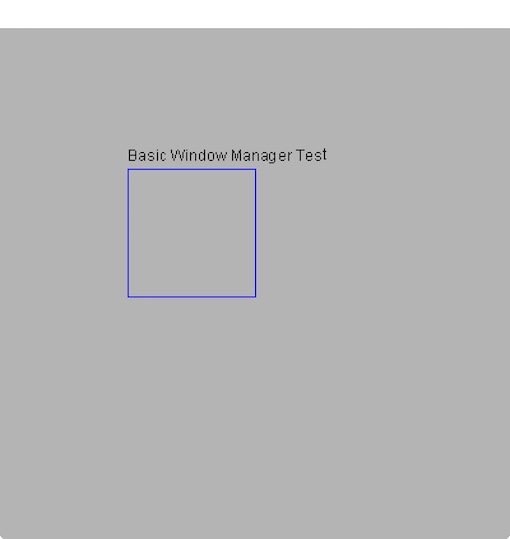

Using An Event Handler
======================

So far we have just done some drawing. But now, we want to 
respond interactively to user input. To do this, we need
to use an *event handler. 

The initial window
------------------

Lets start by making a window that looks like this:

which we do with this code as usual:

.. code-block:: felix

    include "gui/__init__";
    open FlxGui;
    FlxGui::init();

    var w = create_resizable_window("Felix:gui_04_wm_01",100,100,400,400);
    w.add$ mk_drawable FlxGui::clear lightgrey;

    var font_name = dflt_sans_serif_font();
    var font : font_t = get_font(font_name, 12);
    var lineskip = get_lineskip font;

    w.add$ mk_drawable FlxGui::write (100,100,font,black,"Basic Event Handler Test");
    w.add$ mk_drawable draw_line (RGB(0,0,255), 100,110,200,110);
    w.add$ mk_drawable draw_line (RGB(0,0,255), 100,210,200,210);
    w.add$ mk_drawable draw_line (RGB(0,0,255), 100,110,100,210);
    w.add$ mk_drawable draw_line (RGB(0,0,255), 200,110,200,210);

    w.update();
    w.show();

The event handler
-----------------

Now, the next thing is we are going to make a *chip* which can handle
events:

.. code-block:: felix

    chip event_displayer (w:window_t)
      connector pins
        pin inevent : %<event_t
        pin quit: %>int
    {
      while true do
       var e = read pins.inevent;
       var s = 
          match e with
          | WINDOWEVENT we =>
            we.type.SDL_EventType.str + ": " + 
               we.event.SDL_WindowEventID.str + 
               " wid=" + we.windowID.str
          | MOUSEMOTION me =>
            me.type.SDL_EventType.str
          | _ => ""
        ; 
        var linepos = 100 + 4 * lineskip;
        if s != "" do
          println$ s;
          var r = rect_t (100,linepos - 2*lineskip,300,4*lineskip);
          w.remove "evt";
          w.add$ mk_drawable "evt" 100u32 fill (r, green);
          w.add$ mk_drawable "evt" 100u32 FlxGui::write (100,linepos,font,black,"EVENT: "+ s);
          w.update();
        done
      done
    }
     
We are using a powerful new idiom: fibrated programming.
What you see is a special kind of routine called a `coroutine`.
Lets see what it does.

First, the interface tells us that it displays events on window `w`.
Now our chip has a connector named `pins`, and on that connector,
we have two pins named `inevent` and `quit`.

The pin `inevent` is an input pin for data of type `event_t` whilst
the pin `quit` is an output pin for an int. I can tell the direction
of the pin from the channel type: `%<` is for input, and `%>` is for
output. The type of data the pin handles comes next.

Now lets look at the code. We can see immediately this chip runs
in an infinite loop. It starts of by reading an event from the `inevent` pin.

Next, we analyse the event, to see what it is, using a pattern match.
There are two kinds of event we're interested in: a `WINDOWEVENT` and a
`MOUSEMOTION`.

For now, the weird code for these events just converts some of the
event information into a string `s` we can display on the window, lets
not worry about exactly what it means (you'll see, when you try it!).

Now the next bit calculates the position inside the box we drew
to display the string, then, if the event description `s` is not
the null string, we print the string to standard output.

Now we calculate a bounding rectangle for the string. Its not very 
accurate! 

Now comes the fun bit! The next thing we do is *remove* all the drawables
from the window tagged with the string :code:`"evt"`. Then we add
two drawables, the first one fills our bounding rectangle with green,
and the second writes some text. Then we update the window.

Now what is that magical `100u32` you ask? The answer is, this is the
`z` coordinate of the drawing operation, which is a 32 bit unsigned integer. 
When Felix is drawing
on a surface, it draws at the smallest `z` coordinate first.
Then it draws at the next smallest, and so on. At any particular
`z` coordinate, it draws in the order you addes the drawable
to the list of drawables.

By default, drawing occurs at `z=0u32`. So why are we specifying a z coorinate?
The answer is: the background of the window was drawn at `z=0`.
It was not given a tag, so it has the default tag :code:`""`.
Importantly, we did not remove drawables with that tag, so the
background drawable is still in the drawable list.

The thing is, we want to draw *on top* of the background, so we have
to ensure we draw at a higher `z` coordinate.

The Mainline 
------------

Now, as promised, it is time to install our event handler:

.. code-block:: felix
     
    begin
      var qin,qout = mk_ioschannel_pair[int]();
      device windisp = event_displayer w;
      circuit
        connect windisp.inevent, event_source.src 
        wire qout to windisp.quit
      endcircuit

      C_hack::ignore(read qin);
      println$ "QUIT EVENT";
    end
    
The `begin` and `end` here are important for reasons that will
be explained later, for the moment it suffices to know you need
to do this to ensure the schannels we create become inaccessible
when you click to quit, so that the program actually terminates.

The first thing we do is make a single synchronous channel
of type `int` which has two end points: `qin` and `qout`.
The first one, `quin` is a read channel, and the second one, `qout`
is a write channel.

Next, we make a `device` called `windisp` by applying our
event handler function to the window it is to operate on.

Then we build a circuit by connecting the event handler to
an event source, and wiring up the output end of the quit
channel to the event handler as well. Our circuit begins
running immediately.

Now we wait until the user clicks to close the window,
or presses the quit key. On a Mac, Apple-Q is the quit key.
We use :code:`C_hack::ignore` because we don't care what
the quit reason is.

You should see something like this:

.. image:: gui04b.jpeg

