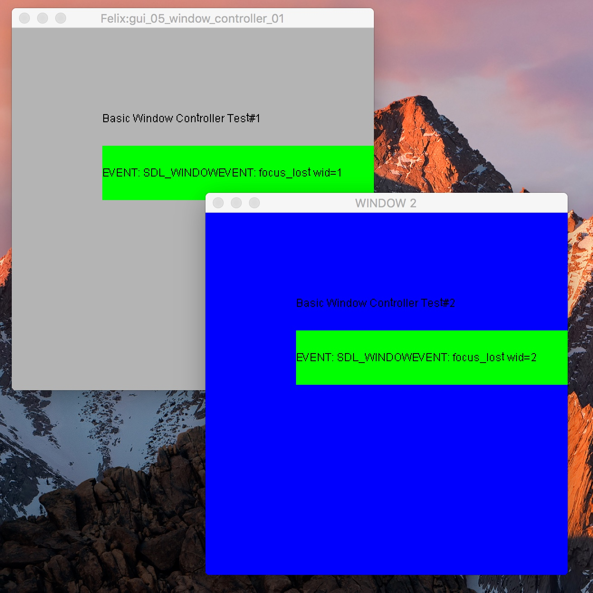

Using a Window Manager
======================

A *window manager* is a component that automates
distribution of message such as mouse clicks and key
presses to one of several event handlers.

The initial windows
-------------------

First our usual setup:

.. code-block:: felix

    include "gui/__init__";
    open FlxGui;

    println$ "Basic Window Controller Test";
    FlxGui::init();

    var font_name = dflt_sans_serif_font();
    var font : font_t = get_font(font_name, 12);
    var lineskip = get_lineskip font;

Now, we make two similar windows, at different locations
but different titles.

.. code-block:: felix
    
    var w1 = create_resizable_window("Felix:gui_05_window_controller_01",100,100,400,400);
    w1.add$ mk_drawable FlxGui::clear lightgrey;
    w1.add$ mk_drawable FlxGui::write (100,100,font,black,"Basic Window Controller Test#1");
    w1.show();
    w1.update();

    var w2 = create_resizable_window("WINDOW 2",400,100,400,400);
    w2.add$ mk_drawable FlxGui::clear blue;
    w2.add$ mk_drawable FlxGui::write (100,100,font,black,"Basic Window Controller Test#2");
    w2.show();
    w2.update();

The Event handler
-----------------

The same as before!

.. code-block:: felix

    // make an event handler for our window
    chip ehandler 
      (var w:window_t)
    connector pins
      pin input : %<event_t
    {
       // get a first event from the window manager
      var e: event_t = read pins.input;
      // while the event isn't a quit event ..
      while e.window.event.SDL_WindowEventID != SDL_WINDOWEVENT_CLOSE  do
        // print a diagnostic
        var s = 
          match e with
          | WINDOWEVENT we =>
            we.type.SDL_EventType.str + ": " + we.event.SDL_WindowEventID.str + " wid=" + we.windowID.str
          | _ => 
            e.type.SDL_EventType.str
        ;
        var linepos = 100 + 4 * lineskip;
        if s != "" do
          println$ s;
          var r = rect_t (100,linepos - 2*lineskip,300,4*lineskip);
          w.add$ mk_drawable fill (r, green);
          w.add$ mk_drawable FlxGui::write (100,linepos,font,black,"EVENT: "+ s);
          w.update();
        done
        // get another event
        e= read pins.input;
      done

      // we must have got a quit ..
      println$ "++++++CLOSE EVENT";
    } 

The Window manager
------------------

Noe for the fun bit. First, our mainline creates a window manager
object:

.. code-block:: felix

    begin
      //create a window manager
      var wm = window_manager();

Now, we create two window controllers.
There will be clients of the window manager.

.. code-block:: felix

      // create a window controller for our window
      var eh1 = ehandler w1;
      var wc1 = window_controller (w1, eh1);
      var eh2 = ehandler w2;
      var wc2 = window_controller (w2, eh2);

Note that in this case the same event handler is bound
to two distinct windows, and then a window controller
is bound to them, as well as the window (again!)

Next, we simply add the window controller clients
to the window manager.

.. code-block:: felix

      // attach controller to window manager
      var wno1 = wm.add_window wc1;
      println$ "Window number " + wno1.str;

      var wno2 = wm.add_window wc2;
      println$ "Window number " + wno2.str;

When we do this, we get back a window number, assigned by the
window manager, so we can refer to the windows in a way
the window manager understands (although we're not doing
that here).

Finally:

.. code-block:: felix

      wm.run_with_timeout 10.0;
      println$ "gui05 quitting";
    end

we just run the window manager, in this case with a timeout
because its a demo. 
